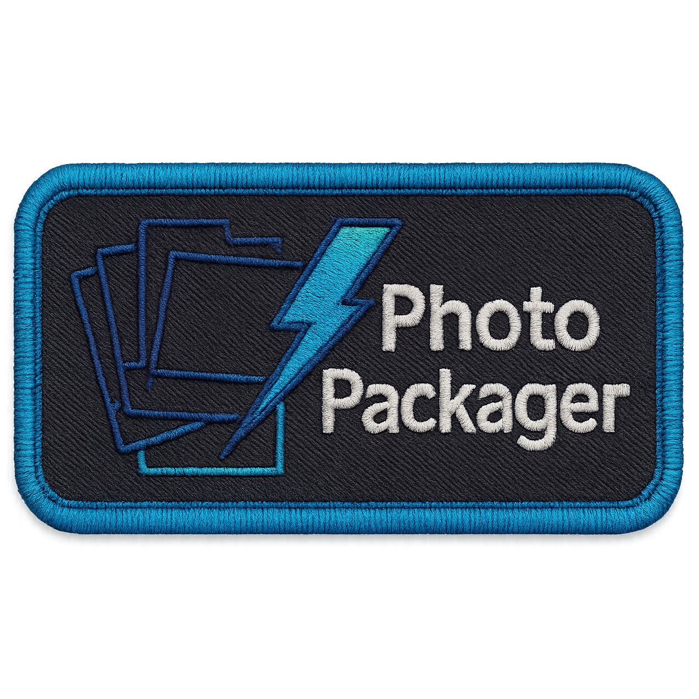
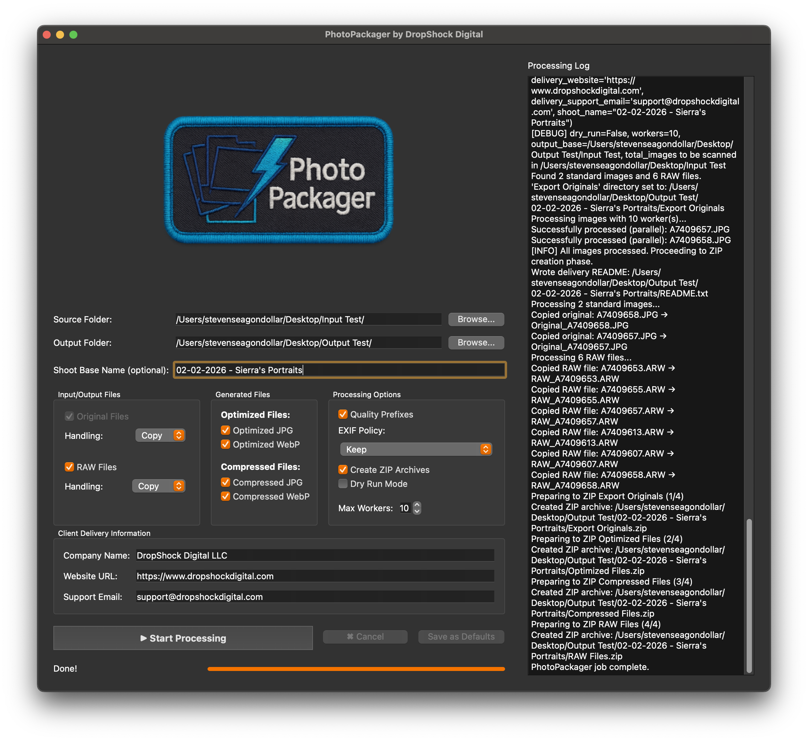

<div align="center">
  
  <h1>PhotoPackager</h1>
  <h3 align="center" style="font-weight: normal; margin-top: -10px; margin-bottom: 10px;">Make Photoshoots Client Accessible</h3>
  <p><strong>A Creative Photoshoot Pipeline Tool By Steven Seagondollar, DropShock Digital</a></strong></p>
  <br>
  <a href="https://www.dropshockdigital.com" target="_blank" rel="noopener noreferrer">
    
  </a>
  <p>
  <br>
    <a href="LICENSE.md"></a>
    <a href="https://www.python.org/downloads/release/python-31210/"></a>
    <a href="https://github.com/seagpt/PhotoPackager/releases/latest"></a>
    <a href="https://github.com/seagpt/PhotoPackager/releases"></a>
  </p>
</div>

---

## 🚀 Quick Download Links

Get the latest version of PhotoPackager directly:

*   🪟 **Windows:**
    *   [**Windows Release Page (PhotoPackager.exe)**](https://github.com/seagpt/PhotoPackager/releases/tag/v1.0.0-exe)
*   🍎 **macOS:**
    *   [**macOS Release Page (PhotoPackager_GUI.dmg)**](https://github.com/seagpt/PhotoPackager/releases/tag/v1.0.0-dmg)

<div align="center" style="margin-top:10px; font-size:0.9em;">
  <em>Always check the <a href="https://github.com/seagpt/PhotoPackager/releases/latest" target="_blank" rel="noopener noreferrer"><strong>Official Releases Page</strong></a> for the very latest versions, detailed release notes, and other assets.</em>
</div>

---

<div align="center">
  <table style="border: none; margin-left: auto; margin-right: auto; margin-top: 25px; margin-bottom: 25px;">
    <tr>
      <td style="padding: 15px; border: none; vertical-align: top; text-align: center;">
        <figure style="margin: 0 auto;">
          
          <br>
          <figcaption style="font-size: 0.95em; color: #555; margin-top: 12px;"><em>PhotoPackager delivering excellence on macOS.</em></figcaption>
        </figure>
      </td>
      <td style="padding: 15px; border: none; vertical-align: top; text-align: center;">
        <figure style="margin: 0 auto;">
          
          <br>
          <figcaption style="font-size: 0.95em; color: #555; margin-top: 12px;"><em>Streamlined workflow with PhotoPackager on Windows.</em></figcaption>
        </figure>
      </td>
    </tr>
  </table>
</div>

---

## 🎯 Overview: Solving the Modern Photographer's Delivery Dilemma

**PhotoPackager** is a professional-grade desktop application meticulously engineered by **Steven Seagondollar** at **DropShock Digital LLC**. It's designed to automate and radically streamline the often complex, time-consuming, and error-prone post-production workflow for photographers, creative studios, marketing agencies, and anyone managing large volumes of digital images.

In today's high-resolution digital landscape, photographers capture stunning detail, resulting in original image files (RAWs or full-quality JPEGs) that can easily be 20MB, 50MB, or even 100MB+ *each*. While these pristine files are essential for archival, professional printing, and intensive re-editing, they present significant challenges when it comes to client delivery and everyday usability:

*   🤯 **Client Overwhelm & Storage Woes:** Most clients, whether large commercial entities or individual consumers, lack the robust local storage, high-speed internet, or technical expertise to comfortably handle hundreds or thousands of massive image files. Downloading, storing, and managing gigabytes (or terabytes!) of photos can quickly overwhelm their devices (smartphones, laptops), clog cloud storage, and lead to significant frustration.
*   🐌 **Usability Barriers & Poor Experience:** Large files are slow to download, cumbersome to share on social media, often too large for standard email attachments, and can make website photo galleries sluggish, resulting in a subpar and often frustrating experience for the end-user who simply wants to enjoy and utilize their images effectively.
*   🧩 **The Multi-Version Nightmare:** Different use cases demand different image specifications. A large-format print requires maximum resolution, a website needs lightweight and fast-loading images, social media platforms have their own optimization preferences and size constraints, and a quick client preview for selection needs to be easily accessible on any device. Manually creating, naming, and organizing all these variants for every single shoot is a monumental, repetitive, and creatively draining task.

**PhotoPackager is the elegant, automated solution to these critical pain points.** It empowers you to reclaim your time and deliver professional, client-friendly packages by:

1.  **🗂️ Organizing Intelligently:** Automatically arranging entire photo shoots into a standardized, professional, and easily configurable folder structure, bringing consistent order to the chaos of post-production.
2.  **⚙️ Processing with Unmatched Versatility:** Generating multiple, purpose-driven delivery formats from your source images in a single, automated pass:
    *   **Originals:** Safely copied or (with extreme caution) moved for archival, print, or master file retention.
    *   **Optimized Versions (JPG/WebP):** Beautifully balanced for exceptional visual fidelity at significantly reduced file sizes, perfect for high-quality digital delivery, client online galleries, and general professional use.
    *   **Compressed Versions (JPG/WebP):** Further resized and compressed for maximum portability and speed, ideal for web galleries requiring fast load times, email attachments, social media sharing, and quick client previews where file size is paramount.

---

## ✨ Key Features: Your All-in-One Delivery Powerhouse

PhotoPackager comes loaded with features meticulously designed to conquer the challenges of the modern photographic workflow, saving you time and elevating your professional presentation:

*   **🖥️ Intuitive Graphical User Interface (GUI):**
    A sleek, modern, and exceptionally easy-to-use desktop application built with **PySide6 (Qt 6.x)**. Allows for straightforward configuration of complex processing jobs and execution with just a few clicks. Ideal for daily studio use by photographers and editors of all technical skill levels, requiring a minimal learning curve.

*   **⌨️ Powerful Command-Line Interface (CLI):**
    A comprehensive non-interactive CLI (accessible via `app.py cli ...`) enabling advanced scripting, full automation of repetitive tasks, and batch processing. Ideal for power users, technical teams, and integration into larger automated workflows. All job settings are loaded from `config/config.json` and `config/user_config.json`, with `source` and `destination` paths provided as command-line arguments overriding any configured paths.
    Example usage:
    ```bash
    python app.py cli --source /path/to/your/photos --destination /path/to/output_folder
    ```
    For detailed CLI options for the `cli` subcommand itself:
    ```bash
    python app.py cli --help
    ```
*   **📂 Standardized & Highly Configurable Output Structure:**
    Automatically generates a consistent, professional, and client-friendly folder hierarchy for each processed shoot. The default structure typically includes: `Export Originals`, `Optimized Files/Optimized JPGs`, `Optimized Files/Optimized WebPs`, `Compressed Files/Compressed JPGs`, `Compressed Files/Compressed WebPs`. **All folder names are fully customizable** in the `config.py` file, allowing you to tailor the output structure to your studio's specific branding or organizational needs.

*   **🖼️ Multi-Format Image Generation Engine:**
    The core of PhotoPackager's power lies in its ability to create multiple, purpose-driven versions from your source files in a single operation:
    *   **Optimized Versions:** Produces high-quality JPEGs and/or WebPs, carefully balanced using configurable quality settings (e.g., quality 85-95 for JPEGs) to retain excellent visual detail while significantly reducing file sizes (often achieving 50-80% reduction compared to full-res originals). Perfect for primary digital delivery, online client galleries, and general professional use where quality is key but original file sizes are impractical.
    *   **Compressed Versions:** Generates further resized (to a configurable target pixel count, e.g., 2048px on the long edge, or a total megapixel target like 2MP) and compressed JPEGs and/or WebPs. These are ideal for web galleries requiring lightning-fast load times, email attachments, social media sharing, and quick client previews, often resulting in dramatic file size reductions (typically 90-98% smaller than originals).
    *   *Granular Control:* Easily toggle JPG and/or WebP generation for each category (Optimized, Compressed). Choose to skip compressed versions entirely if not needed. All quality settings, resizing parameters (including target megapixels or long-edge pixels), and WebP compression effort levels are configurable via the GUI and `config.py`.

*   **🔢 Consistent Sequential File Renaming:**
    Systematically renames all output files (Optimized, Compressed, and any copied/moved Originals) to a clear, consistent, and sortable `###-<ShootBaseName>.ext` format (e.g., `001-Johnson_Family_Portraits_2025.jpg`, `002-Johnson_Family_Portraits_2025.webp`). The `Shoot Base Name` is provided by you for each job, ensuring easy identification, professional presentation, and hassle-free sorting for both you and your clients.

*   **🛡️ Configurable & Safe Originals Handling:**
    Provides flexible and, above all, **safe** options for managing your precious source image files during processing:
    *   `Copy`: (Default & Safest) Safely duplicates your original files into the `Export Originals` folder. Your source files remain untouched.
    *   `Move`: (**HIGH RISK!**) Permanently moves original files from source to output. **Ensure you have verified backups before using this option!**
    *   `Leave`: Originals are left untouched in their source location; no copies are made to the output package.
    *   `Skip Export`: Originals are ignored completely for this processing job; no `Export Originals` folder will be created.
    *   **EXTREME CAUTION:** The `Move` option is a destructive operation. It will PERMANENTLY delete files from their original location. Ensure you have reliable, verified, and independent backups *before* using this option. Test thoroughly with `--dry-run` first on non-critical data.

*   **🏷️ Granular EXIF Metadata Control:**
    Offers precise, configurable control over how EXIF (Exchangeable Image File Format) metadata is handled in the *generated* (Optimized and Compressed) images. Choose exactly how much metadata to keep:
    *   **Keep:** Preserves all original EXIF metadata.
    *   **Strip All:** Removes all EXIF data for maximum privacy (default if `piexif` is not available for selective options).
    *   **Date Only:** Keeps most EXIF but removes date and time-related tags (requires the `piexif` library).
    *   **Camera Only:** Keeps most EXIF but removes camera make/model and lens information tags (requires the `piexif` library).
    *   **Date & Camera:** Keeps most EXIF but removes both date/time and camera/lens tags (requires the `piexif` library).
    This ensures you can tailor the output to specific privacy needs or client requirements. If the `piexif` library is not installed, selective removal options (Date Only, Camera Only, Date & Camera) will fall back to "Strip All". The original source files are *never* modified.

*   **💬 Share Feedback & Help Us Improve (User-Initiated Reporting):**
    Your insights are invaluable! PhotoPackager includes a "Feedback & Support" option in the Help menu, designed to make it easy for you to share your experiences, suggest features, or report issues directly to DropShock Digital.
    *   **How it Works:** When you select this option, a dialog will appear allowing you to type your message.
    *   **Optional Job Summary Inclusion:** Crucially, you'll have the **choice** to include a detailed summary of your most recently completed PhotoPackager job. This summary can include information like the processing options selected, the number of files processed, and any non-sensitive error messages encountered (error details are anonymized to protect your privacy). *No image data or personal files are ever included.*
    *   **Sending Your Feedback:**
        *   On **macOS**, the application will attempt to open your default email client with a pre-filled email addressed to DropShock Digital, containing your feedback and, if you chose to include it, the job summary.
        *   On **Windows** (and as a fallback on macOS), the application will display all the necessary information (recipient email, suggested subject, your feedback, and the job summary if included) in a way that you can easily copy and paste it into your preferred email client.
    *   **Why This Helps Us (and You!):** By sharing your feedback, and optionally your job summary, you're directly contributing to the improvement of PhotoPackager. This information allows DropShock Digital to:
        *   Understand how the application is being used in real-world scenarios.
        *   Identify popular features and areas that might need more attention.
        *   Troubleshoot issues more effectively with concrete (yet privacy-respecting) data.
        *   Gather insights on the app's overall usage patterns and success, guiding future development.
    This system is entirely user-initiated and relies on your choice to share information, ensuring you are always in control.

*   **📦 Automatic Multi-ZIP Archiving:**
    Optionally creates up to three distinct `.zip` archives (`Export Files.zip`, `Optimized Files.zip`, `Compressed Files.zip`) in the main output folder. This greatly streamlines the process of preparing files for client delivery via download links, file transfer services (like WeTransfer, Dropbox), or for providing organized archives on physical media. This feature can be easily enabled or disabled via the GUI or CLI.

*   **⚡ Efficient Multi-Core Processing (CLI):**
    Leverages multiple CPU cores for image processing tasks when run via the Command Line Interface (CLI), significantly speeding up large jobs. (GUI currently processes sequentially but benefits from an optimized pipeline).

*   **🔔 Desktop Notifications (Optional):**
    Attempts to provide native OS desktop notifications upon job completion or encountering a critical error. This keeps you informed of the processing status without needing to constantly monitor the application window, allowing you to multitask more effectively (requires optional libraries/tools like `win10toast-reborn` on Windows or leverages native macOS notification capabilities).

*   **📝 Comprehensive & Actionable Logging:**
    Generates a detailed `photopackager_run.log` file within each job's output folder. This log captures all operations performed, the settings used for the job, processing times, any warnings encountered (e.g., skipped files), and critical error messages with tracebacks. This log is invaluable for troubleshooting issues, keeping a record of processing parameters, and understanding the details of each job run.

---

## 🚀 Launching PhotoPackager (from source) & CLI Usage

If you are running PhotoPackager directly from the Python source code (i.e., not using a pre-packaged `.exe` or `.app`):

*   **Always use `app.py` to start the application:**
    ```bash
    python app.py
    ```
    This single command will launch the Graphical User Interface (GUI) by default.

*   **Do NOT run `main.py` or files within the `gui/` directory (like `main_window.py`) directly.** These are internal modules and will not initialize the application correctly or load necessary configurations.

*   **Command Line Interface (CLI) Mode:**
    PhotoPackager also offers a powerful CLI for batch processing and automation. To use the CLI, invoke `app.py` with the `cli` subcommand:
    ```bash
    python app.py cli [options...]
    ```
    For a full list of CLI options and commands, use:
    ```bash
    python app.py cli --help
    ```

---

## 🧪 For Developers & Contributors

If you plan to contribute to PhotoPackager or run it from source for development purposes, please note the following:

*   **Entry Point:**
    The application uses `app.py` as the sole, unified entry point for both GUI and CLI modes. The legacy `ui.py` file is deprecated and should not be used. All packaging scripts, build processes, and manual launch commands (for development or testing) **must** target `app.py`.

*   **Build Philosophy:**
    *   **Comprehensive Logging:** All official packaged builds (and source runs by default) include full logging and debugging capabilities to aid in troubleshooting and understanding application behavior.
    *   **Clean Packaging:** When creating new packaged distributions (e.g., `.dmg` for macOS, `.zip` for Windows portable), any existing files with the same name in the output directory are automatically removed before the new package is generated. This ensures clean builds and avoids confusion with outdated versions.

*   **Testing Requirements:**
    The automated test suite (`pytest`) requires real JPEG image files (not synthetically generated ones) to be present in the `assets/test_images/` directory within the project root. This is crucial for validating EXIF data handling, Pillow plugin compatibility, and color profile management across various real-world image types. Ensure these images cover a range of EXIF tags and scenarios.

---

## 💾 Installation: Get Up & Running Smoothly

PhotoPackager is designed for easy setup on both Windows and macOS. We strongly recommend using our pre-built packaged applications for the simplest and quickest installation experience.

### Method 1: Installing the Packaged Application (Recommended for All Users)

No Python installation or technical command-line expertise needed! Just download, install (or extract), and run.

#### 🪟 Windows Installation

Choose either the Installer or Portable version based on your preference:

1.  **Download:**
    *   **Installer:** `PhotoPackager_GUI_Installer.exe` from the [Official Releases Page](https://github.com/seagpt/PhotoPackager/releases/latest). This version will guide you through a standard installation process and create shortcuts.
    *   **Portable:** `PhotoPackager_GUI_Portable.zip` from the [Official Releases Page](https://github.com/seagpt/PhotoPackager/releases/latest). This version can be run directly after extraction without installation, ideal for carrying on a USB drive or avoiding system-wide installs.
2.  **Run/Extract:**
    *   **Installer (`.exe`):**
        1.  Double-click the downloaded `PhotoPackager_GUI_Installer.exe`.
        2.  **Windows Defender SmartScreen:** You will likely see a "Windows protected your PC" prompt. This is a standard security measure for new applications from independent developers that haven't yet established a broad reputation with Microsoft.
            *   Click on the "**More info**" link within the SmartScreen dialog.
            *   Verify the app name (e.g., "PhotoPackager GUI").
            *   Click the "**Run anyway**" button.
        3.  Follow the on-screen instructions in the installer wizard (e.g., accept the license agreement, choose your preferred installation location, decide on shortcut creation).
    *   **Portable (`.zip`):**
        1.  Right-click the downloaded `PhotoPackager_GUI_Portable.zip` file and select "**Extract All...**" (or use your preferred unzipping utility like 7-Zip or WinRAR).
        2.  Choose a folder on your computer where you want to place the application files (e.g., `C:\Program Files\PhotoPackagerPortable` or `D:\PortableApps\PhotoPackager`).
        3.  Once extracted, navigate into the created folder.
3.  **Launch:**
    *   **Installer Version:** Launch PhotoPackager from your Windows Start Menu or the Desktop shortcut created by the installer.
    *   **Portable Version:** Double-click the `PhotoPackager_GUI.exe` (or simply `app.exe` if renamed in packaging) file from within the folder where you extracted the portable version. (The SmartScreen prompt might also appear on the first run of the portable executable; follow the same "More info" -> "Run anyway" steps if it does).

#### 🍎 macOS Installation

1.  **Download:** Get the `PhotoPackager_GUI.dmg` (Disk Image) file from the [Official Releases Page](https://github.com/seagpt/PhotoPackager/releases/latest).
2.  **Mount & Install:**
    *   Double-click the downloaded `.dmg` file. This will mount a virtual disk image and typically open a Finder window showing its contents.
    *   Inside this Finder window, you will see the `PhotoPackager_GUI.app` icon (and often a shortcut to your Applications folder).
    *   Drag the `PhotoPackager_GUI.app` icon from this window and drop it into your main `/Applications` folder (usually found in the Finder sidebar or by going to "Go > Applications" in the menu bar).
    *   After copying, you can eject the mounted "PhotoPackager" disk image from Finder (e.g., by dragging its icon on your Desktop to the Trash/Eject icon, or Ctrl-clicking/right-clicking on it in the Finder sidebar and selecting "Eject").
3.  **First Launch (Important macOS Security Step):**
    Due to macOS's Gatekeeper security feature, you may need to perform an extra step the very first time you launch an application downloaded from the internet that isn't from the App Store or an Apple-notarized developer.
    *   Navigate to your `/Applications` folder in Finder.
    *   Locate `PhotoPackager_GUI.app`.
    *   **Right-click** (or hold the `Control` key and click) on the `PhotoPackager_GUI.app` icon.
    *   Select "**Open**" from the contextual menu that appears.

---

## 📜 License & Acknowledgements

{{ ... }}
