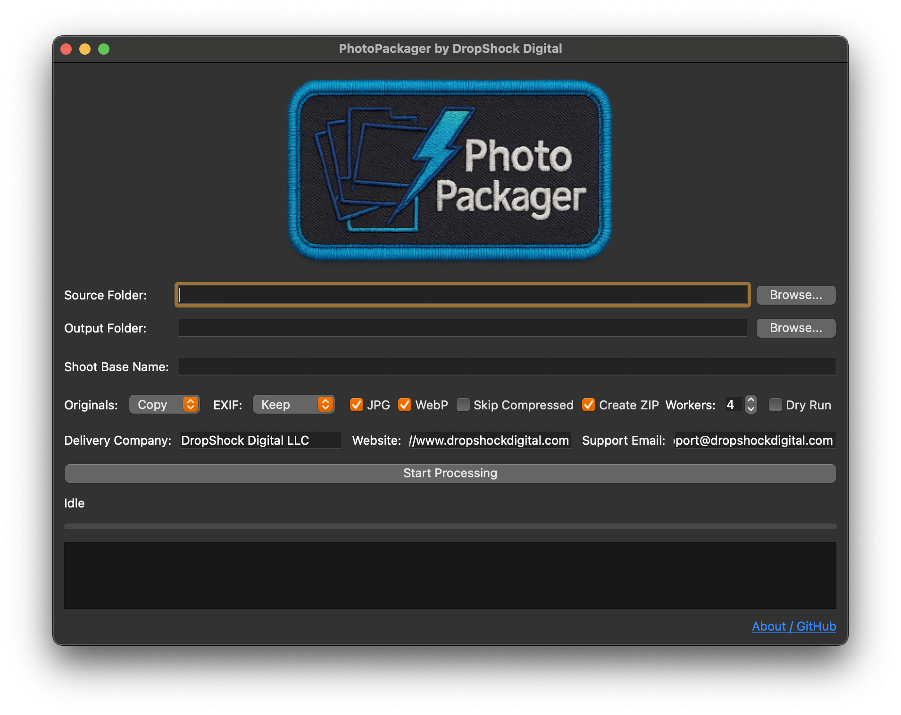

  
  <h1>PhotoPackager for macOS</h1>
  
<strong>Version 1.0.0 (Initial Release)</strong>

  
<strong>by <a href="https://www.dropshockdigital.com" target="_blank" rel="noopener noreferrer">Steven Seagondollar, DropShock Digital LLC</a></strong>

  

---

**Release Date:** *(Insert Actual Release Date, e.g., November 5, 2023)*

## 🚀 Download PhotoPackager v1.0.0 for macOS

*   [**Download PhotoPackager_GUI.dmg.zip (macOS Universal)**](PhotoPackager_GUI.dmg.zip)
    *(This link should point directly to the `PhotoPackager_GUI.dmg.zip` asset in this GitHub Release.)*

    **Important Download Note:** The PhotoPackager application for macOS is provided as an Apple Disk Image (`.dmg`), which has then been compressed into a `.zip` archive. This extra zipping step helps ensure smoother downloads from platforms like GitHub and can prevent potential security blocks by some web browsers or macOS Gatekeeper that occasionally occur with direct `.dmg` file downloads. **You will need to unzip the downloaded `PhotoPackager_GUI.dmg.zip` file first to access and use the enclosed `PhotoPackager_GUI.dmg` file.**

---

## 👋 Welcome to PhotoPackager for macOS!

This is the first official release of **PhotoPackager** specifically for the macOS platform. PhotoPackager is a powerful desktop tool designed to automate essential post-production tasks for photographers and creative studios, helping you organize, process, and package your photo shoots efficiently and professionally.

This macOS version provides the full functionality of PhotoPackager through an intuitive Graphical User Interface (GUI).

For a complete overview of PhotoPackager's capabilities, all its features, detailed usage instructions (including the GUI walkthrough and CLI information if you choose to run from source), advanced configuration, and troubleshooting, please consult the main project [**README.md file**](../../README.md). This release note focuses specifically on getting started with this macOS package.

---

## 🍎 macOS Installation & First Launch

Follow these steps to install and run PhotoPackager on your Mac:

1.  **Download & Unzip:**
    *   Click the download link above to get the `PhotoPackager_GUI.dmg.zip` file.
    *   Once downloaded (usually to your `Downloads` folder), double-click the `.zip` file. Your Mac's Archive Utility should automatically extract its contents, resulting in a file named `PhotoPackager_GUI.dmg`.

2.  **Mount the Disk Image:**
    *   Double-click the extracted `PhotoPackager_GUI.dmg` file. This will mount the disk image on your system, and a new Finder window will typically open, showing the contents of this mounted image (usually the `PhotoPackager_GUI.app` icon).

3.  **Install the Application:**
    *   From the Finder window that opened (showing the contents of the mounted DMG), **drag the `PhotoPackager_GUI.app` icon** and drop it into your main `/Applications` folder. (Your `/Applications` folder is usually found in the Finder sidebar or by selecting "Go > Applications" from the Finder menu bar). This copies the application to your Mac.

4.  **Eject the Disk Image:**
    *   After copying the application, you can eject the mounted "PhotoPackager" disk image. To do this, find its icon (either on your Desktop or in the Finder sidebar), then Ctrl-click (or right-click) on it and select "Eject".

5.  **First Launch (Important macOS Gatekeeper Step):**
    Since PhotoPackager is distributed outside the Mac App Store and this initial release may not be notarized by Apple, macOS Gatekeeper (a security feature) will likely require you to explicitly approve running it the first time:
    *   Navigate to your `/Applications` folder in Finder.
    *   Locate `PhotoPackager_GUI.app`.
    *   **Right-click** (or hold `Control` and click) on `PhotoPackager_GUI.app`.
    *   From the context menu that appears, select "**Open**".
    *   A dialog box may appear warning that "macOS cannot verify the developer..." or that the app is from an "unidentified developer." This is expected. Click the "**Open**" button in this dialog.
    *   ***Alternative (if the "Open" button is not available in the warning):*** Go to **System Settings > Privacy & Security**. Scroll down to the "Security" section. You should see a message stating that `PhotoPackager_GUI.app` was blocked. Click the "**Open Anyway**" button next to this message. You might be asked for your Mac administrator password.
    *   This approval is typically only needed for the very first launch. Subsequent launches can usually be done by double-clicking the app icon.

6.  **Using PhotoPackager:**
    PhotoPackager is now ready to use! Launch it from your Applications folder. For guidance on its features and how to use the interface, please see the "GUI Walkthrough" section in the main [README.md](../../README.md).

    

      
      
<em>The PhotoPackager interface on macOS.</em>

    

---

## ✨ macOS Version Highlights (v1.0.0)

This initial macOS release of PhotoPackager delivers the core suite of tools designed to streamline your photo delivery workflow:

*   **Native macOS Application:** A self-contained `.app` bundle for easy installation and use on macOS.
*   **Full GUI Functionality:** Access all PhotoPackager features through its user-friendly graphical interface, including source/output selection, processing option configuration (originals handling, EXIF policies, format generation, ZIP creation), and client branding for README files.
*   **Support for macOS Native File Dialogs:** Uses standard macOS open/save dialogs for a familiar user experience.
*   **Desktop Notifications:** (If supported by your macOS version and settings) Attempts to use native macOS notifications for job status updates.

*(For a complete list of all application features, please consult the "Key Features" section in the main [README.md](../../README.md).)*

---

## 🛠️ System Requirements for macOS

*   **Operating System:** macOS 11.0 (Big Sur) or later.
*   **Architecture:** Universal Binary (supports both Apple Silicon and Intel-based Macs).
*   **RAM (Memory):** 8GB RAM minimum; 16GB or more recommended for processing very large image sets or high-resolution files.
*   **Hard Disk Space:** Approximately 200-300MB for the application itself. Sufficient additional free space is required for your source images and the generated output packages.
*   **Display:** A screen resolution of 1280x800 pixels or higher is recommended.

---

## ⚠️ Known Considerations for This macOS Release

*   **Gatekeeper Warning on First Launch:** As this application is not yet notarized by Apple, you will encounter a security warning from Gatekeeper when you first try to open it. Please follow the "First Launch" instructions above (using Right-click > Open, or System Settings > Privacy & Security) to allow the application to run.
*   **Initial Verification Time:** The very first time you launch PhotoPackager, macOS may take a few extra moments to verify the application before it opens. Subsequent launches should be faster.

---

## 🛟 Support & Feedback for macOS Version

If you encounter issues specific to this macOS version of PhotoPackager, or have feedback related to its performance or behavior on macOS:

*   **Primary Support:** Please refer to the contact methods in the main [README.md](../../README.md) (Email: `support@dropshockdigital.com`, GitHub Issues).
*   When reporting macOS-specific issues, please include your **macOS version** (e.g., Sonoma 14.1.1), the **PhotoPackager version (v1.0.0)**, and details about your Mac hardware (e.g., M1 MacBook Pro, Intel iMac).

---

## 📜 License

PhotoPackager is licensed under the **MIT License**.
Copyright (c) 2024-2025 Steven Seagondollar, DropShock Digital LLC.

For the full license text, please see the [LICENSE.md](../../LICENSE.md) file in the main project repository.